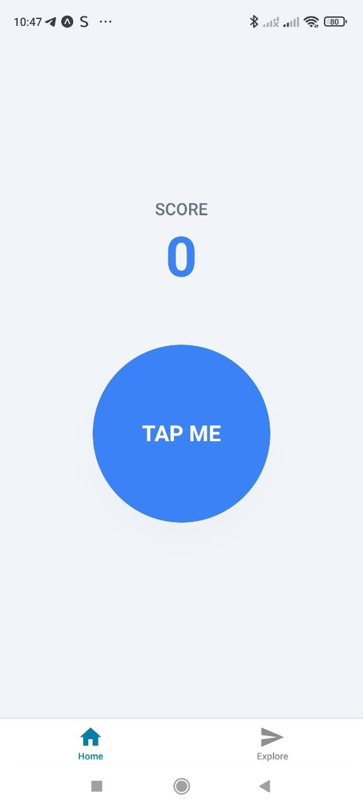
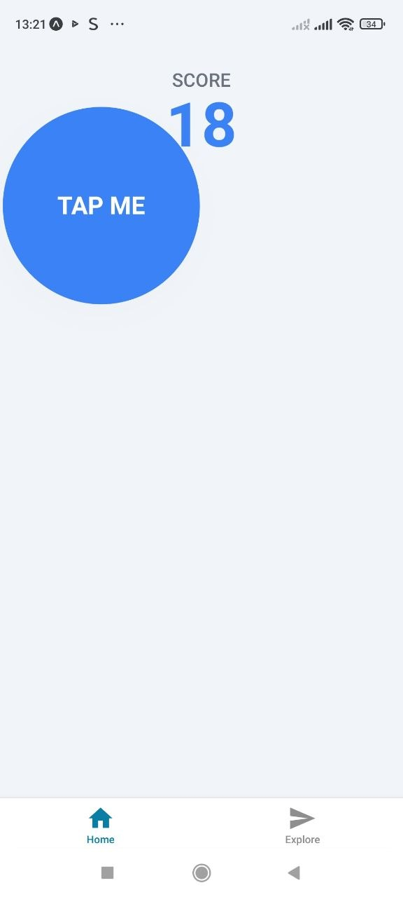
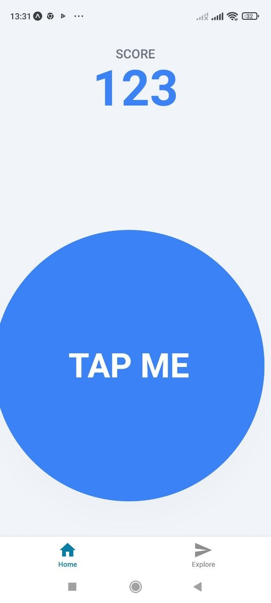
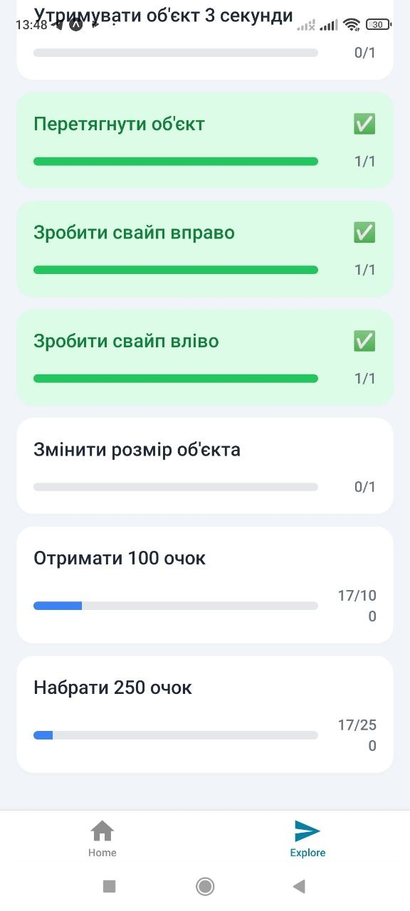
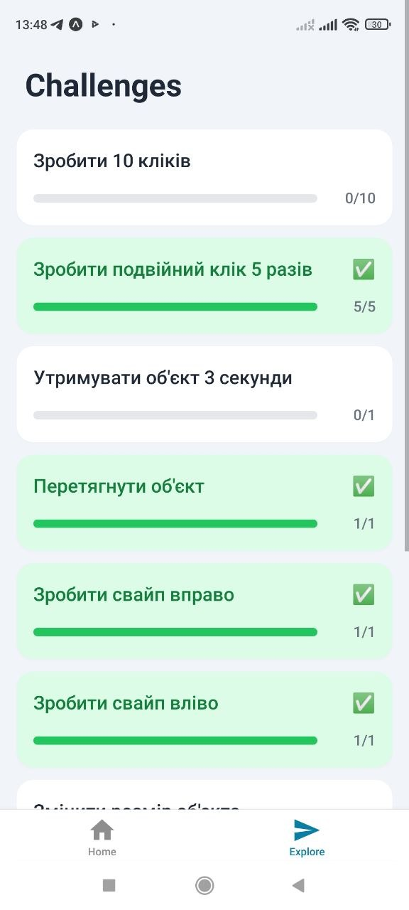
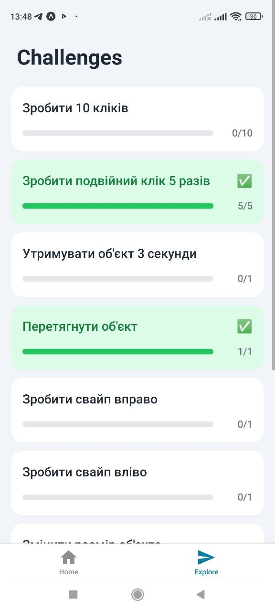
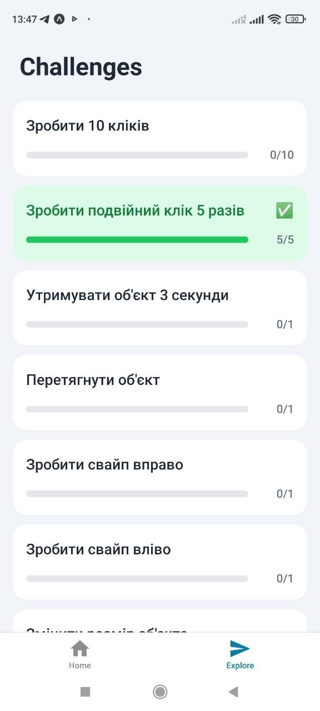

# Лабораторна робота №3: Використання кастомних жестів у React Native

**Виконала:** студентка групи IPZ-24-3, Литвинчук Ольга (ФІКТ)

## Опис реалізованого функціоналу
У ході виконання лабораторної роботи було розроблено мобільний додаток – гру-клікер з використанням жестових взаємодій користувача.

**Основні реалізовані функції:**
* Обробка різноманітних жестів за допомогою `react-native-gesture-handler` (Tap, Double Tap, Long Press, Pan для перетягування, Fling для свайпів, Pinch для масштабування).
* Глобальне управління станом застосунку (збереження рахунку та прогресу завдань) за допомогою React Context API.
* Стилізація інтерфейсу з використанням NativeWind (Tailwind CSS) з підтримкою світлої та темної теми.
* Візуалізація прогресу виконання завдань (Challenges) за допомогою динамічних індикаторів.

## Інструкція запуску
1. Склонуйте репозиторій на свій комп'ютер:
   ```bash
   git clone https://github.com/Olga-sun/MobileLabsRN2026.git
2. Перейдіть у папку з проєктом та встановіть необхідні залежності:   
   npm install
3. Запустіть сервер розробки з очищенням кешу:
   npx expo start -c
4. Відскануйте згенерований QR-код за допомогою додатку Expo Go на вашому смартфоні.








Висновки
Під час виконання лабораторної роботи було успішно закріплено навички роботи з бібліотекою react-native-gesture-handler.
На практиці реалізовано взаємодію з користувачем через складні комбінації жестів (одночасні та ексклюзивні жести за 
допомогою Gesture.Simultaneous та Gesture.Exclusive). Застосовано бібліотеку react-native-reanimated для плавної трансформації
елементів (перетягування та зміна розміру) на UI-потоці. Інтерфейс успішно стилізовано за допомогою NativeWind.