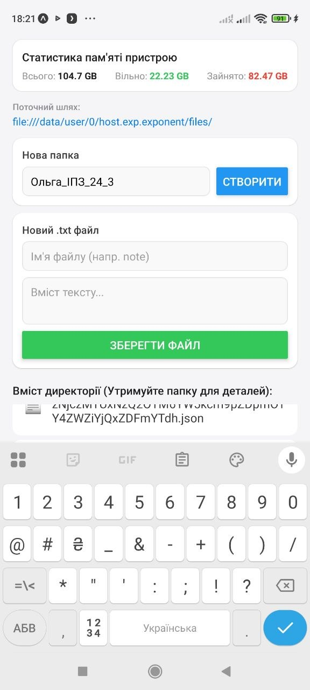
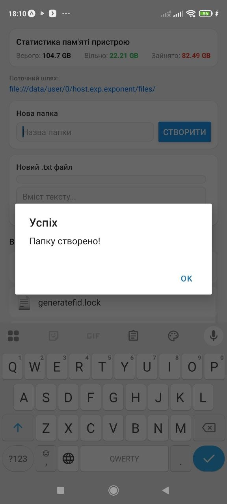
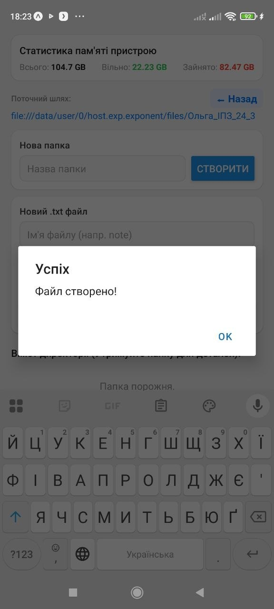
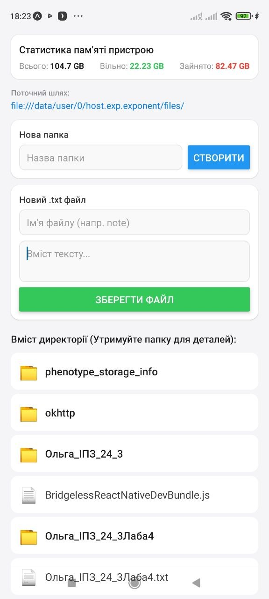
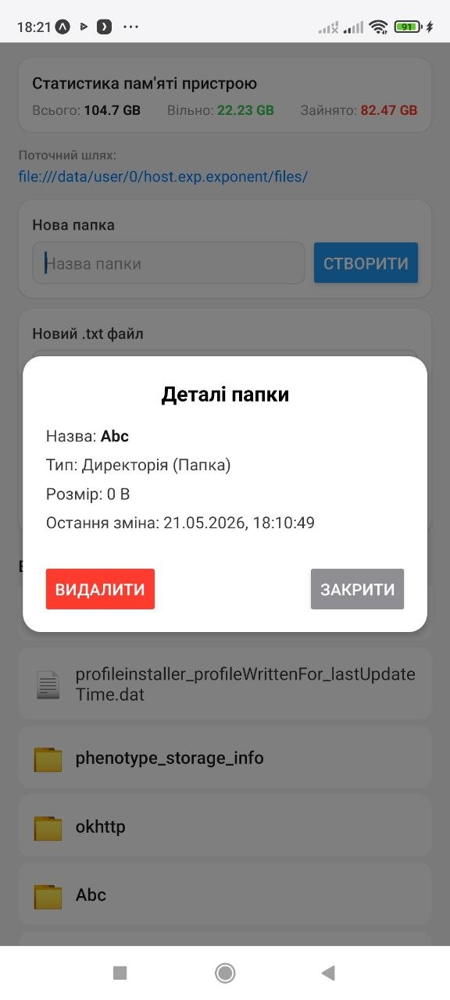
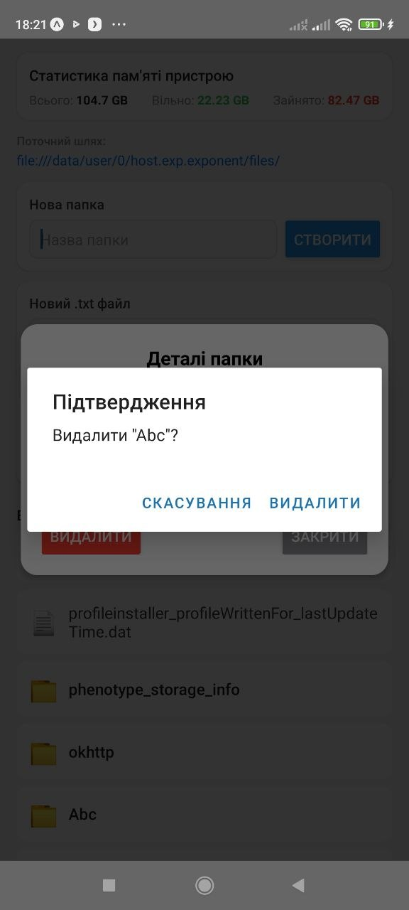

# Лабораторна робота №4: Робота з файловою системою

**Виконала:** студентка групи ІПЗ-24-3, Литвинчук Ольга  
**Дисципліна:** Розробка мобільних застосунків  
**Технології:** React Native, Expo (SDK 54), `expo-file-system`

---


Для того, щоб запустити проєкт локально, виконайте наступні кроки:

1. **Клонування репозиторію та перехід у папку:**
   ```bash
   git clone https://github.com/Olga-sun/MobileLabsRN2026.git
   cd lab4
2. Встановлення залежностей:
   Переконайтеся, що у вас встановлено Node.js. Виконайте команду для встановлення необхідних пакетів:  
   npm install
3. Запуск сервера розробки:
   Запустіть Expo-сервер з очищенням кешу для уникнення конфліктів:
   npx expo start -c
   У рамках цієї лабораторної роботи було створено повноцінний мобільний Файловий менеджер, який працює в ізольованій директорії додатка (documentDirectory).

Реалізовано наступні можливості:

Навігація: Відображення поточного шляху, можливість заходити всередину створених папок та повертатися на рівень вище за допомогою кнопки "Назад".

Створення об'єктів: - Створення нових папок через форму введення.

Створення текстових файлів (.txt) із можливістю одразу задати їх початковий вміст.

Зчитування директорії: Динамічне відображення списку файлів та папок у поточному каталозі за допомогою компонента FlatList.

Статистика пам'яті: Автоматичний підрахунок та відображення загальної, вільної та зайнятої пам'яті пристрою у зручному форматі (KB, MB, GB).

Детальна інформація: Перегляд інформації про файл/папку (тип, розмір у байтах, дата останньої зміни) у модальному вікні.

Редагування: Можливість відкрити існуючий .txt файл, змінити його текстовий вміст та зберегти зміни.

Видалення: Безпечне видалення файлів та директорій із попереднім вікном-підтвердженням.
# Скріншоти роботи застосунку






Під час виконання лабораторної роботи було успішно розроблено мобільний застосунок "Файловий менеджер" з використанням фреймворку **React Native** та платформи **Expo**.

**У результаті роботи я:**
* Опанувала роботу з локальною файловою системою мобільного пристрою (читання, запис та видалення даних) за допомогою бібліотеки `expo-file-system`.
* Реалізувала базові CRUD-операції для директорій та текстових документів.
* Створила інтерактивний користувацький інтерфейс (UI) з підтримкою навігації по вкладених папках, виведенням статистики пам'яті та використанням модальних вікон (`Modal`) для перегляду деталей.
* Покращила розуміння роботи з асинхронним кодом (`async / await`) та станами компонентів (`useState`, `useEffect`) у React.
* Здобула цінний практичний досвід вирішення проблем сумісності версій (dependency resolution) та міграції застарілих API на прикладі екосистеми Expo SDK.

Завдання лабораторної роботи виконано в повному обсязі, створений застосунок працює стабільно та повністю відповідає поставленим вимогам.