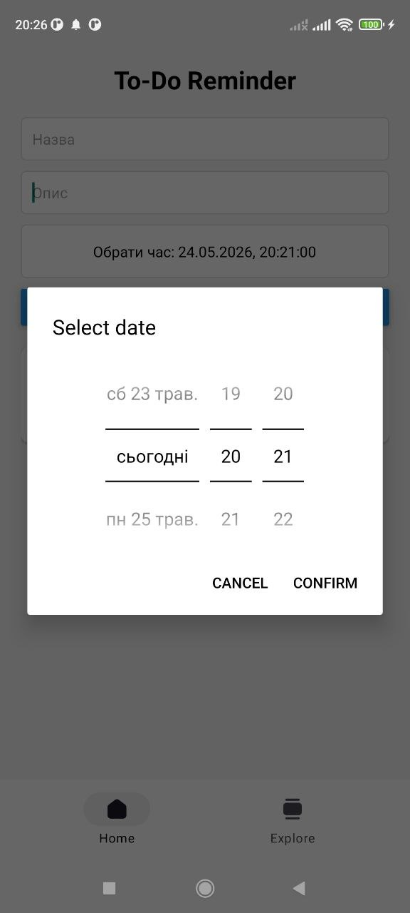
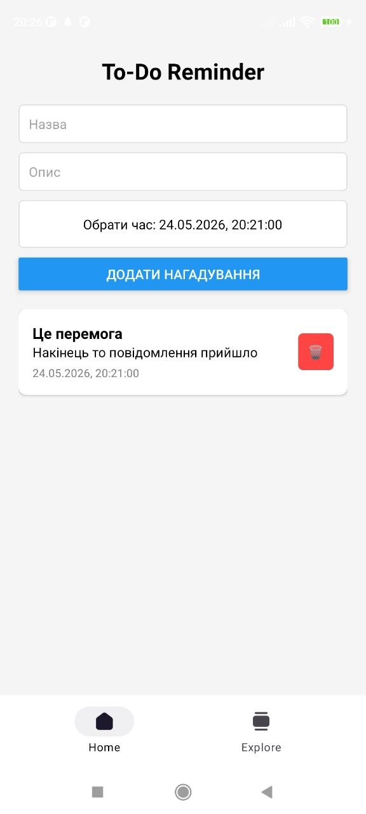
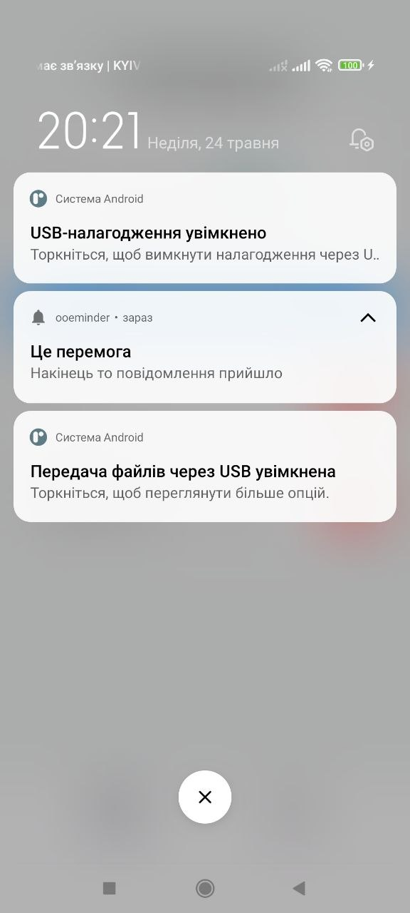
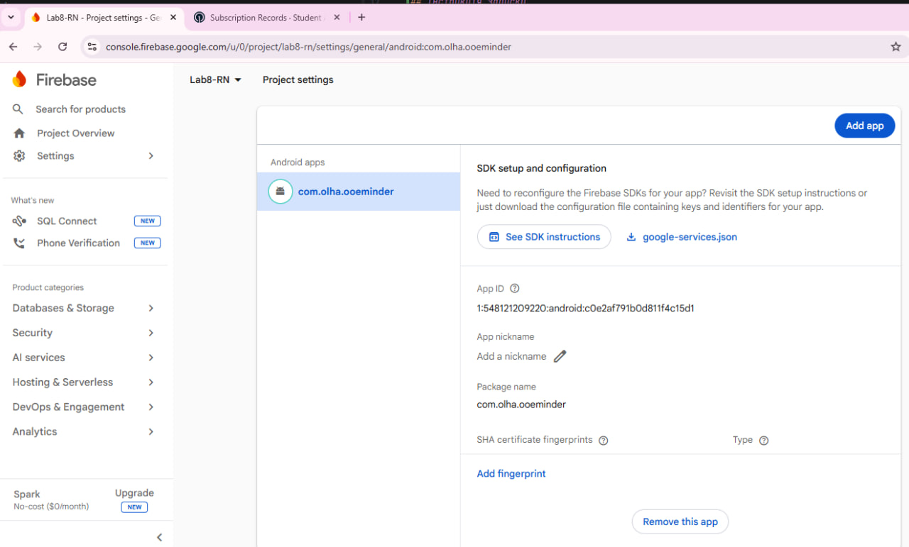
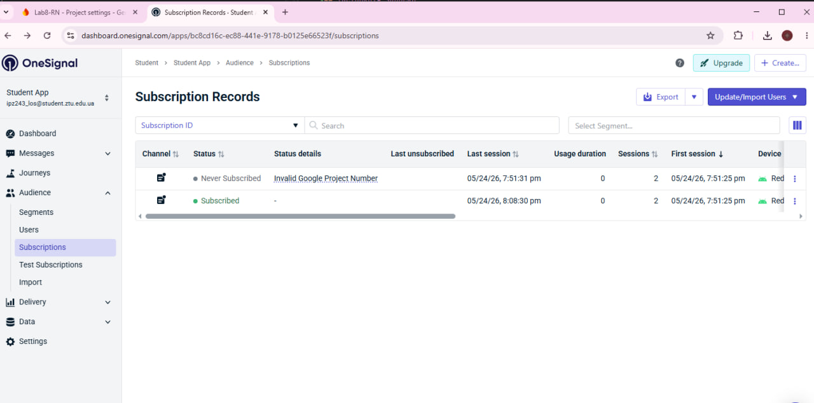
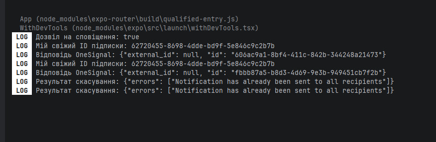

# Лабораторна робота: Застосунок To-Do Reminder (Push-сповіщення)

**Виконала:** студентка групи ІПЗ-24-3, Житомирська політехніка (ФІКТ)

## Опис реалізованого функціоналу
Застосунок "To-Do Reminder" — це мобільний менеджер завдань із функцією відкладених push-сповіщень, розроблений за допомогою React Native (Expo).

Основні можливості застосунку:
* Додавання нових завдань із вказанням назви, опису та точного часу нагадування через DatePicker.
* Інтеграція зі стороннім сервісом OneSignal API для планування та відправки push-сповіщень.
* Використання Firebase Cloud Messaging (FCM) як базового провайдера для доставки сповіщень на ОС Android.
* Динамічне відображення списку запланованих завдань.
* Видалення завдань зі списку з одночасним скасуванням запланованого push-сповіщення через OneSignal REST API.

---

## Інструкція запуску

Для локального розгортання та тестування застосунку виконайте наступні кроки:

1. Клонуйте репозиторій та перейдіть у кореневу папку проєкту.
2. Встановіть необхідні залежності командою:
   ```bash
   npm install
3. Переконайтеся, що конфігураційний файл google-services.json (отриманий з Firebase Console) знаходиться в кореневій папці проєкту, а в app.json прописано шлях до нього у блоці android.

4. Запустіть проєкт на Android-пристрої або емуляторі:
   npx expo run:android
5. При першому запуску застосунку на пристрої обов'язково надайте системний дозвіл на отримання сповіщень.






1. Що таке push-сповіщення і як воно працює?
   Push-сповіщення — це повідомлення, яке надсилається віддаленим сервером на мобільний пристрій користувача, навіть якщо застосунок у цей момент закритий або працює у фоновому режимі. Механізм працює за принципом підписки: пристрій реєструється у хмарному сервісі, отримує унікальний ідентифікатор (токен), і сервер використовує цей токен для цілеспрямованої маршрутизації та доставки повідомлення через інтернет.

2. Яка роль Firebase Cloud Messaging у потоці надсилання повідомлень?
   Firebase Cloud Messaging (FCM) виступає в ролі надійного транспортного шлюзу між нашим сервером (або сервісом OneSignal) та операційною системою Android. Хоча OneSignal відповідає за логіку, сегментацію та формування повідомлення, фізичну доставку пуша на конкретний Android-пристрій здійснює саме інфраструктура FCM. Для цього застосунок використовує файл google-services.json, який авторизує його в екосистемі Google.

3. Як запланувати та скасувати сповіщення через OneSignal API?

Запланувати: Виконується POST-запит на ендпоінт https://api.onesignal.com/notifications. У тілі запиту (JSON) передається app_id, заголовок, текст, масив отримувачів (include_player_ids або included_segments), а також параметр send_after, де вказується точний час у форматі ISO 8601 для відкладеної відправки.

Скасувати: Виконується DELETE-запит на ендпоінт https://api.onesignal.com/notifications/{notificationId}?app_id={ONESIGNAL_APP_ID}, де notificationId — це унікальний ідентифікатор сповіщення, який сервер OneSignal повернув у відповідь на успішний POST-запит під час планування.

4. Як обробляти push-сповіщення коли застосунок відкрито (foreground)?
   Для обробки сповіщень, коли застосунок активний (foreground), використовуються спеціальні слухачі подій (event listeners), які надає SDK бібліотеки (наприклад, OneSignal.Notifications.addEventListener('foregroundWillDisplay', ...)). Це дозволяє перехопити сповіщення безпосередньо в коді до того, як воно з'явиться в системній шторці Android. Розробник може вирішити: приховати системний банер, показати власне модальне вікно (Alert) або тихо оновити дані на екрані.